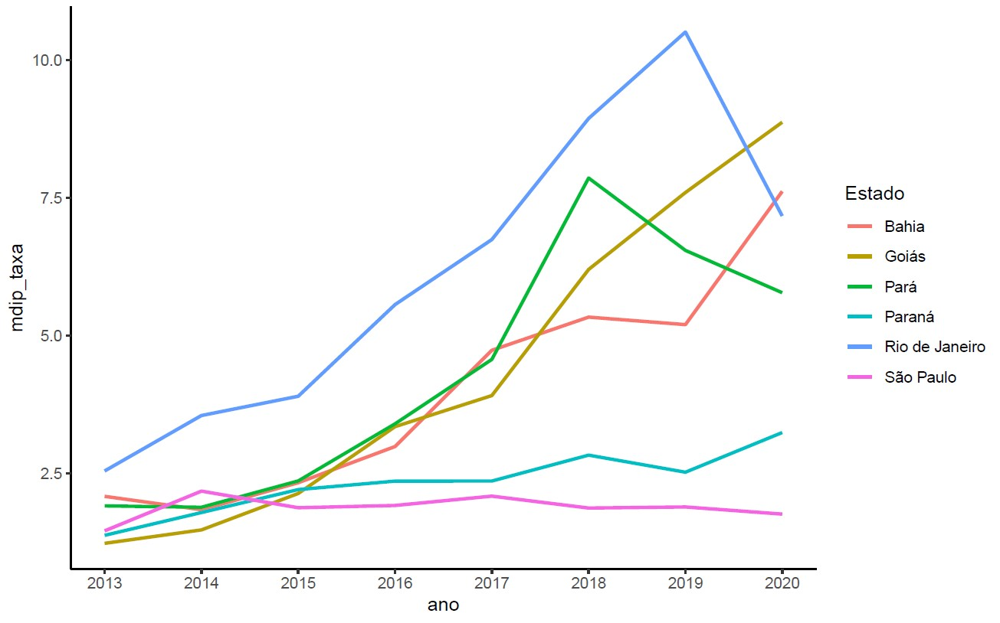
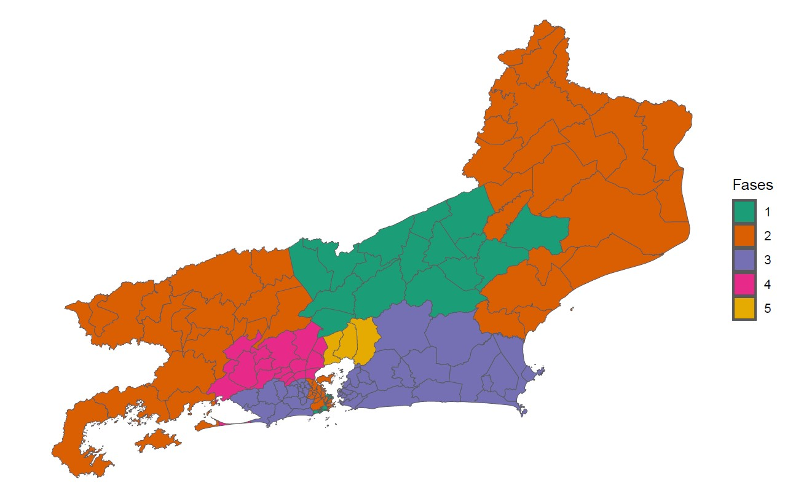
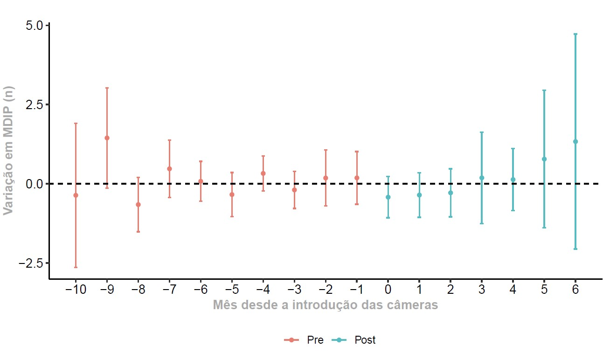

# body_worn_cameras_rj

## Introduction

One of the pronounced apprehensions pertaining to the deployment of body-worn cameras (BWCs) pertains to the conceivable dissuasive ramifications they might impose upon law enforcement personnel. To elucidate, the utilization of such devices could potentially engender a decrement in the vigor of exertion exhibited by said agents, thereby engendering a diminution in both their overall efficacy and proactive demeanor. Regrettably, this diminishment in performance transpires sans concurrent concretization of the envisaged fortification of institutional accountability (Magaloni, 2021). However, extant and contemporary empirical substantiation postulates that the deleterious impact on the comportment of security agents is not ostensibly manifest vis-à-vis the utilization of BWCs. Furthermore, it is germane to underscore that this technological modality assumes a salient mantle as an extrinsic mechanism of oversight, duly amplifying accountability paradigms by exerting discernible influence upon the calculus governing utilization of force (Joana et al., 2023; Williams et al., 2021; Kim, 2022, Maskaly, Jon, et al., 2017).

## Institutional Background

There are three police institutions responsible for public security in the state of Rio de Janeiro. However, they have distinct roles within the security framework. The primary entity responsible for conspicuous policing in Brazil is the Military Police, encompassing around 400,000 officers nationwide, and they are overseen by the respective Governor of each Brazilian state.

No gráfico XX, temos as estatísticas de morte por intervenção policial para o rio de janeiro e alguns outros estados. 

## How BWCs were introduced in Rio de Janeiro Police Force?

In 2020, the Brazilian Supreme Federal Court, in response to several complaints of excessive use of force and executions by the security forces in Rio de Janeiro, demanded the creation of a State Plan for the Reduction of Lethality. As part of the plan, the Supreme Court also required the introduction of operational portable body cameras on police uniforms to measure external control over police activities. However, the State Government, which is in charge of the police, strongly resisted implementing this measure. The cameras were only deployed in mid-2022. Even then, not all police detachments are utilizing the technology. To comprehend the impacts of body cameras on the use of force, a dynamic difference-in-differences model was employed. 

The state of Rio de Janeiro has been divided into several integrated zones to improve the organization, planning, and coordination of efforts related to public security. This division is structured into three levels: (i) RISP - Integrated Public Security Regions, (ii) CISP - Integrated Public Security Circuits, and (iii) AISP - Integrated Public Security Areas. This study will specifically concentrate on the Integrated Public Security Areas (AISP) level, which designates specific territories for each battalion within the Military Police of Rio de Janeiro (PMERJ).

The following image illustrates the timeline at which each territorial unit (battalion) received the cameras.

## Data

The data used in this work are from:

* Crime recorders - Institute of Public Security (http://www.ispdados.rj.gov.br/estatistica.html).
* Information regarding the introduction of cameras in the police battalions - Documents of ADPF nº 635 (https://portal.stf.jus.br/processos/detalhe.asp?incidente=5816502).

## Empirical Strategy

Formmally, the main econometric goal is to estimate the Average Treatment Effect on Treated (ATT) for each group g treated at different moments in time t and then aggregate them using a weighting vector:

$$ 
ATT(g,t) = E[Y_{t}^{1} - Y_{t}^{0} | G_{g} = 1].
$$

where g is the group treated and t is the time that each group received the treatment. To incorporate the various waves of treatment and, consequently, the variation in control and treatment groups over time, we used the estimator proposed by Callaway & Sant'Anna (2021). In practice, the following equation is estimated for all pairs of treated and untreated groups throughout the implementation phases:

 $$ 
Y_{mt} = &alpha; + &delta; BWC_{m} + &phi; Post_{t} + &beta;  (BWC &times; Post) _{mt} + &epsilon; _{mt}.
$$

## Results

Here, we present the event-study plot and table.

As evident from the event-study graph, the BWCs exhibits no significant impact on deaths resulting from police interventions, diverging from the findings observed in recent studies.

## Discussion

## Conclusion
